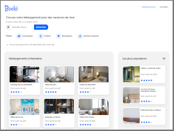

# P2: HTML & CSS / Booki website

## Project's presentation

Booki is a small company offering a vacation planning tool! Its site allows users to find accommodation and activities in the city of their choice. The accommodations can also be filtered by theme, for example their budget or their atmosphere.

Before definitively validating the design, the company decided to produce a prototype. I am responsible for creating this prototype by integrating the model in **HTML and CSS**.

This project does not include functional elements, it is only HTML and CSS formatting. It is mobile, tablet and desktop **responsive**.
